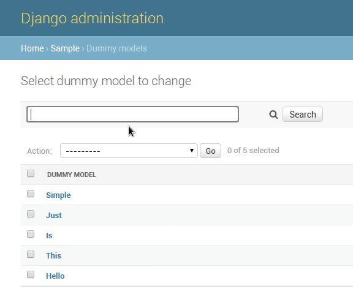

Django-search-admin-autocomplete
--------------------------------

Simple django app that add autocomplete to search inside admin panel.

Installation
============

.. code-block:: bash

    pip install git+https://github.com/linevich/django-search-admin-autocomplete.git

.. code-block:: python

    INSTALLED_APPS = [
    ...
    'search_admin_autocomplete',
    ...
]

Usage
=====
.. code-block:: python

    from search_admin_autocomplete.admin import SearchAutoCompleteAdmin

    class MyModelAdmin(SearchAutoCompleteAdmin)
        search_fields = ['search_field', ]

    admin.site.register(MyModel, MyModelAdmin)

